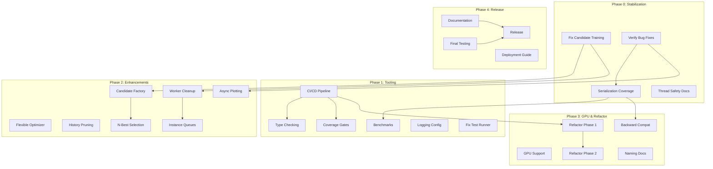

# Juniper Cascor - Development Roadmap

**Created**: 2025-01-12  
**Version**: 1.0.0  
**Status**: Active  
**Current Release**: v0.3.2 (MVP Complete)  
**Target Release**: v1.0.0 (Research-Grade Release)  
**Author**: Development Team

---

## Executive Summary

This roadmap defines the path from the current MVP (v0.3.2) to a research-grade 1.0 release of Juniper Cascor. The plan prioritizes **stability and correctness** first, followed by **developer tooling**, then **feature enhancements**, and finally **documentation and polish**.

### Key Objectives

1. **Stabilize the Core** - Fix all critical bugs and verify existing fixes
2. **Establish Quality Gates** - CI/CD, type checking, coverage requirements
3. **Complete Feature Set** - Flexible optimizers, GPU support, N-best selection
4. **Document for Users** - User guide, examples, deployment guidance
5. **Achieve Research-Grade Quality** - Reliable, reproducible, well-documented

### Timeline Overview

| Phase   | Version | Duration  | Focus             |
| ------- | ------- | --------- | ----------------- |
| Phase 0 | v0.3.x  | 2-3 days  | Stabilization     |
| Phase 1 | v0.4.0  | 1-2 weeks | Tooling & Quality |
| Phase 2 | v0.5.0  | 2-3 weeks | Core Enhancements |
| Phase 3 | v0.6.0  | 2-3 weeks | GPU & Refactoring |
| Phase 4 | v1.0.0  | 1-2 weeks | Polish & Release  |

**Total Estimated Duration**: 8-12 weeks

---

## Table of Contents

1. [Prioritization Framework](#prioritization-framework)
2. [Phase 0: Stabilization (v0.3.x)](#phase-0-stabilization-v03x)
3. [Phase 1: Tooling & Quality (v0.4.0)](#phase-1-tooling--quality-v040)
4. [Phase 2: Core Enhancements (v0.5.0)](#phase-2-core-enhancements-v050)
5. [Phase 3: GPU & Refactoring (v0.6.0)](#phase-3-gpu--refactoring-v060)
6. [Phase 4: Research-Grade Release (v1.0.0)](#phase-4-research-grade-release-v100)
7. [Task Dependency Graph](#task-dependency-graph)
8. [Success Metrics](#success-metrics)
9. [Risk Management](#risk-management)
10. [Appendix: Complete Task Inventory](#appendix-complete-task-inventory)

---

## Prioritization Framework

### MoSCoW Classification

Tasks are categorized using the **MoSCoW method**:

| Category        | Definition                                              | Phase Target |
| --------------- | ------------------------------------------------------- | ------------ |
| **Must Have**   | Blocks correctness, reproducibility, or basic usability | Phases 0-1   |
| **Should Have** | Important quality and maintainability improvements      | Phases 1-2   |
| **Could Have**  | Nice-to-have features for research flexibility          | Phases 2-3   |
| **Won't Have**  | Explicitly deferred or experimental work                | Post-v1.0    |

### Effort Estimation Scale

| Size   | Time Estimate | Description                               |
| ------ | ------------- | ----------------------------------------- |
| **S**  | < 1 hour      | Simple fix, small config change           |
| **M**  | 1-3 hours     | Single-file change, moderate complexity   |
| **L**  | 1-2 days      | Multi-file change, requires testing       |
| **XL** | > 2 days      | Significant feature, architectural change |

### Priority Mapping

| Priority | MoSCoW | Description                                 |
| -------- | ------ | ------------------------------------------- |
| P0       | Must   | Critical bugs blocking functionality        |
| P1       | Must   | High-priority fixes and core infrastructure |
| P2       | Should | Important enhancements and improvements     |
| P3       | Could  | Research features and optimizations         |
| P4       | Won't  | Deferred to post-v1.0                       |

---

## Phase 0: Stabilization (v0.3.x)

**Duration**: 2-3 days  
**Goal**: Fix critical runtime issues and verify existing bug fixes  
**Entry Criteria**: Current codebase  
**Exit Criteria**: All P0 issues resolved, core training loop functional

### P0-001: Fix Candidate Training Runtime Errors

**Priority**: P0 (Must)  
**Effort**: M-L  
**Status**: ✅ COMPLETED (2025-01-13)

**Description**: Current runtime errors prevent successful training:

- `CandidateUnit._init_display_progress()` signature mismatch (`TypeError`)
- Parallel candidate training returning tuples instead of `TrainingResult` objects
- `'tuple' object has no attribute 'correlation'` in `_process_training_results`

**Tasks**:

- [x] Fix `_train_candidate_worker` → `_train_candidate_unit` method call in `cascade_correlation.py:1782`
- [x] Fix `UnboundLocalError` for `traceback` import in exception handler
- [x] Add `__getstate__`/`__setstate__` to `LogConfig` for proper pickling
- [x] Add `__getstate__`/`__setstate__` to `CascadeCorrelationConfig` for proper pickling
- [x] Update `CascadeCorrelationNetwork.__getstate__` to exclude `log_config`
- [ ] Add unit tests for candidate training result handling

**Files Affected**:

- `src/cascade_correlation/cascade_correlation.py`
- `src/log_config/log_config.py`
- `src/cascade_correlation/cascade_correlation_config/cascade_correlation_config.py`

**Dependencies**: None

---

### P0-002: Verify BUG-001 and BUG-002 Fixes

**Priority**: P0 (Must)  
**Effort**: S-M  
**Status**: Verification Pending  

**Description**: Previous bug fixes implemented but not verified in correct environment:

- BUG-001: Random state restoration test failures
- BUG-002: Logger pickling error in multiprocessing

**Tasks**:

- [ ] Set up correct Python environment (`conda activate JuniperCascor`)
- [ ] Run random state restoration tests
- [ ] Run serialization test suite
- [ ] Execute `main.py` end-to-end with plotting enabled
- [ ] Document verification results

**Verification Commands**:

```bash
cd src/tests
python -m pytest integration/test_serialization.py -v
python -m pytest integration/test_comprehensive_serialization.py -v
cd ../
python main.py
```

**Dependencies**: Working conda environment

---

### P0-003: Complete Serialization Test Coverage

**Priority**: P0 (Must)  
**Effort**: M  
**Status**: In Progress  

**Description**: Ensure serialization tests pass and meet coverage targets.

**Tasks**:

- [ ] Run coverage report for `snapshot_serializer.py`
- [ ] Identify coverage gaps
- [ ] Add tests to achieve ≥80% coverage
- [ ] Verify all existing serialization tests pass

**Success Criteria**:

- `snapshot_serializer.py` coverage ≥ 80%
- All serialization integration tests passing
- No critical errors in diagnostic checks

**Dependencies**: P0-002

---

### P0-004: Document Thread Safety Constraints

**Priority**: P0 (Must)  
**Effort**: S  
**Status**: ✅ COMPLETED (2025-01-13)

**Description**: The network is not thread-safe. This must be clearly documented.

**Tasks**:

- [x] Add thread safety warning to README.md
- [x] Add warning to `FEATURES_GUIDE.md`
- [x] Add docstring warning to `CascadeCorrelationNetwork` class

**Dependencies**: None

---

## Phase 1: Tooling & Quality (v0.4.0)

**Duration**: 1-2 weeks  
**Goal**: Establish CI/CD, type checking, and quality gates  
**Entry Criteria**: Phase 0 complete  
**Exit Criteria**: CI pipeline running, coverage gates enforced

### P1-001: CI/CD Pipeline Setup

**Priority**: P1 (Must)  
**Effort**: M-L  
**Status**: Not Started  

**Description**: Establish automated testing and quality checks.

**Tasks**:

- [ ] Create GitHub Actions workflow (`.github/workflows/ci.yml`)
- [ ] Configure pytest with coverage reporting
- [ ] Add type checker (mypy or pyright)
- [ ] Add linting (flake8/ruff or Trunk integration)
- [ ] Configure artifact upload for coverage reports
- [ ] Add workflow status badge to README

**Workflow Components**:

```yaml
jobs:
  test:
    - pytest with coverage
    - coverage report upload
  lint:
    - flake8 or ruff
  typecheck:
    - mypy or pyright
```

**Dependencies**: Phase 0 complete

---

### P1-002: Type Checker Configuration

**Priority**: P1 (Should)  
**Effort**: M  
**Status**: Not Started  

**Description**: Add static type checking to catch errors early.

**Tasks**:

- [ ] Create `mypy.ini` or `pyproject.toml` with mypy config
- [ ] Start with permissive settings (ignore untyped, external)
- [ ] Fix critical type errors in core modules
- [ ] Document type checking in AGENTS.md

**Initial Configuration**:

```ini
[mypy]
python_version = 3.13
warn_return_any = True
warn_unused_configs = True
ignore_missing_imports = True
```

**Dependencies**: CI pipeline (P1-001)

---

### P1-003: Coverage Gates and Baseline

**Priority**: P1 (Should)  
**Effort**: S-M  
**Status**: Not Started  

**Description**: Establish and enforce minimum coverage thresholds.

**Tasks**:

- [ ] Run baseline coverage report
- [ ] Set coverage gates: 70% overall, 80% for snapshots
- [ ] Configure CI to fail on coverage regression
- [ ] Add coverage badge to README

**Dependencies**: CI pipeline (P1-001)

---

### P1-004: Performance Benchmark Harness

**Priority**: P1 (Should)  
**Effort**: M  
**Status**: Not Started  

**Description**: Create reproducible performance benchmarks.

**Tasks**:

- [ ] Create `benchmarks/` directory
- [ ] Add serialization benchmarks (save, load, checksum)
- [ ] Add training benchmarks (candidate pool, forward pass)
- [ ] Document baseline performance metrics
- [ ] Add benchmark results to `reports/`

**Performance Targets**:

| Operation        | Target      | Conditions       |
| ---------------- | ----------- | ---------------- |
| Save (100 units) | < 2 seconds | gzip compression |
| Load (100 units) | < 3 seconds | -                |
| Checksum verify  | < 200 ms    | SHA256           |

**Dependencies**: P0-003 (stable serialization)

---

### P1-005: Logging Performance Configuration

**Priority**: P1 (Should)  
**Effort**: M  
**Status**: Not Started  

**Description**: Current logging is verbose and may impact performance.

**Tasks**:

- [ ] Add environment variable for log level override
- [ ] Create "quiet" preset for production/benchmarking
- [ ] Reduce debug logging in hot paths (training loops)
- [ ] Document logging configuration options

**Implementation**:

```python
# Support env var override
log_level = os.environ.get('JUNIPER_LOG_LEVEL', 'INFO')
```

**Dependencies**: None

---

### P1-006: Test Runner Script Fix

**Priority**: P1 (Must)  
**Effort**: S  
**Status**: Open  

**Description**: `run_tests.bash` has syntax error on line 315 (unexpected EOF).

**Tasks**:

- [ ] Fix quoting issue in `scripts/run_tests.bash`
- [ ] Test all script options (-u, -i, -v, -c, etc.)
- [ ] Document test runner usage

**Dependencies**: None

---

## Phase 2: Core Enhancements (v0.5.0)

**Duration**: 2-3 weeks  
**Goal**: Complete core feature set and improve robustness  
**Entry Criteria**: Phase 1 complete  
**Exit Criteria**: All P2 enhancements implemented

### P2-001: Candidate Factory Refactor (ENH-005)

**Priority**: P2 (Should)  
**Effort**: M  
**Status**: Partially Complete  

**Description**: Ensure all candidate creation uses factory method.

**Tasks**:

- [ ] Audit all `CandidateUnit` instantiation points
- [ ] Route all creation through `_create_candidate_unit()` factory
- [ ] Add tests for consistent initialization
- [ ] Verify sequential and parallel training use same creation path

**Dependencies**: P0-001 (candidate training fix)

---

### P2-002: Flexible Optimizer System (ENH-006)

**Priority**: P2 (Should)  
**Effort**: M-L  
**Status**: Not Started  

**Description**: Support multiple optimizer types via configuration.

**Tasks**:

- [ ] Finalize `OptimizerConfig` dataclass
- [ ] Implement optimizer factory supporting: Adam, SGD, RMSprop, AdamW
- [ ] Add serialization support for optimizer configuration
- [ ] Add tests for each optimizer type
- [ ] Document optimizer configuration in FEATURES_GUIDE.md

**API Example**:

```python
config = CascadeCorrelationConfig(
    optimizer_type='AdamW',
    learning_rate=0.001,
    weight_decay=0.01
)
```

**Dependencies**: Stable training loop

---

### P2-003: Worker Cleanup Improvements (ENH-008)

**Priority**: P2 (Should)  
**Effort**: M  
**Status**: Not Started  

**Description**: Ensure multiprocessing resources are properly cleaned up.

**Tasks**:

- [ ] Implement graceful worker shutdown with timeouts
- [ ] Add SIGKILL fallback for hung workers
- [ ] Add cleanup verification logging
- [ ] Test repeated training calls in single process
- [ ] Add worker lifecycle documentation

**Dependencies**: P0-001 (parallel training fix)

---

### P2-004: Memory Management - History Pruning

**Priority**: P2 (Should)  
**Effort**: M-L  
**Status**: Not Started  

**Description**: Training history grows unbounded; add pruning option.

**Tasks**:

- [ ] Add `max_history_length` configuration option
- [ ] Implement history pruning (retain last N epochs)
- [ ] Add option for summary statistics only
- [ ] Add memory usage logging for long runs
- [ ] Document memory management in FEATURES_GUIDE.md

**Dependencies**: None

---

### P2-005: N-Best Candidate Selection (ENH-007)

**Priority**: P2 (Could)  
**Effort**: L  
**Status**: Not Started  

**Description**: Add multiple candidates per layer for faster convergence.

**Tasks**:

- [ ] Add `candidates_per_layer` configuration option
- [ ] Implement `_select_best_candidates()` method
- [ ] Modify network growth to install multiple units
- [ ] Add tests for multi-candidate selection
- [ ] Verify convergence behavior with N-best
- [ ] Document in FEATURES_GUIDE.md

**Dependencies**: P0-001, P2-001

---

### P2-006: Per-Instance Queue Management (ENH-009)

**Priority**: P3 (Could)  
**Effort**: M-L  
**Status**: Not Started  

**Description**: Avoid cross-instance interference in multiprocessing.

**Tasks**:

- [ ] Replace global queues with instance-scoped queues
- [ ] Update manager lifecycle to be instance-bound
- [ ] Add tests for multiple network instances
- [ ] Document multi-instance usage patterns

**Dependencies**: P2-003

---

### P2-007: Process-Based Plotting (ENH-010)

**Priority**: P3 (Could)  
**Effort**: M  
**Status**: Blocked (BUG-002 verification needed)  

**Description**: Enable non-blocking plot generation.

**Tasks**:

- [ ] Add `plot_decision_boundary_async()` public API
- [ ] Implement process-based plotting with picklable data
- [ ] Add smoke tests for async plotting
- [ ] Document async plotting usage

**Dependencies**: P0-002

---

## Phase 3: GPU & Refactoring (v0.6.0)

**Duration**: 2-3 weeks  
**Goal**: Add GPU support and improve code quality  
**Entry Criteria**: Phase 2 complete  
**Exit Criteria**: GPU tests passing, large files refactored

### P3-001: GPU/CUDA Support

**Priority**: P2 (Should)  
**Effort**: L  
**Status**: Partially Implemented  

**Description**: Ensure all operations support CUDA devices.

**Tasks**:

- [ ] Audit all tensor operations for device consistency
- [ ] Add `device` configuration option
- [ ] Ensure serialization handles device transfer correctly
- [ ] Add GPU test suite (marked with `@pytest.mark.gpu`)
- [ ] Document GPU usage and requirements

**GPU Test Example**:

```python
@pytest.mark.gpu
def test_training_on_cuda():
    config = CascadeCorrelationConfig(device='cuda')
    network = CascadeCorrelationNetwork(config=config)
    # ...
```

**Dependencies**: Stable training, serialization tests

---

### P3-002: Large File Refactoring - Phase 1

**Priority**: P2 (Should)  
**Effort**: L  
**Status**: Not Started  

**Description**: Extract helpers from large files (cascade_correlation.py: 3690 lines).

**Strategy**: Incremental extraction without API changes

**Tasks**:

- [ ] Extract multiprocessing logic to `cascade_multiprocessing.py`
- [ ] Extract training helpers to `cascade_training.py`
- [ ] Extract validation helpers to `cascade_validation.py`
- [ ] Ensure all tests pass after each extraction
- [ ] Target: No file > 2000 lines after Phase 1

**Files to Refactor**:

| File                     | Current Lines | Target |
| ------------------------ | ------------- | ------ |
| `cascade_correlation.py` | 3690          | < 2000 |
| `candidate_unit.py`      | 1423          | < 1000 |
| `spiral_problem.py`      | 1496          | < 1000 |

**Dependencies**: CI pipeline, good test coverage

---

### P3-003: Large File Refactoring - Phase 2

**Priority**: P3 (Could)  
**Effort**: XL  
**Status**: Deferred to Phase 3  

**Description**: Deeper restructuring by concern.

**Tasks**:

- [ ] Separate serialization glue from core training
- [ ] Create clear module boundaries
- [ ] Document module responsibilities
- [ ] Target: No file > 1500 lines

**Dependencies**: P3-002

---

### P3-004: Parameter Naming Convention Documentation

**Priority**: P2 (Should)  
**Effort**: S-M  
**Status**: Not Started  

**Description**: Clarify mixed naming conventions.

**Tasks**:

- [ ] Document naming convention in CONVENTIONS.md
- [ ] Consider thin config DTO for external users
- [ ] Update examples to use clearer patterns

**Dependencies**: None

---

### P3-005: Backward Compatibility Testing (ENH-011)

**Priority**: P2 (Should)  
**Effort**: M  
**Status**: Not Started  

**Description**: Ensure new code can load old snapshots.

**Tasks**:

- [ ] Create reference snapshot fixtures (v0.3.2+)
- [ ] Add backward compatibility test suite
- [ ] Add graceful failure for incompatible versions
- [ ] Document version migration in FEATURES_GUIDE.md

**Dependencies**: P0-003 (stable serialization)

---

## Phase 4: Research-Grade Release (v1.0.0)

**Duration**: 1-2 weeks  
**Goal**: Polish, document, and release  
**Entry Criteria**: Phase 3 complete  
**Exit Criteria**: v1.0.0 released

### P4-001: README and Documentation Overhaul

**Priority**: P1 (Should)  
**Effort**: M-L  
**Status**: Not Started  

**Description**: Create user-focused documentation.

**Tasks**:

- [ ] Expand README with quickstart and examples
- [ ] Create comprehensive USER_GUIDE.md
- [ ] Add example scripts to `examples/` directory
- [ ] Document all configuration options
- [ ] Add architecture diagrams

**Documentation Structure**:

```bash
docs/
├── README.md (quickstart)
├── USER_GUIDE.md (comprehensive guide)
├── API_REFERENCE.md (existing)
├── ARCHITECTURE_GUIDE.md (existing)
├── CONVENTIONS.md (new)
└── DEPLOYMENT.md (new)
```

**Dependencies**: Stable APIs

---

### P4-002: Deployment Guide

**Priority**: P2 (Could)  
**Effort**: M  
**Status**: Not Started  

**Description**: Document production deployment patterns.

**Tasks**:

- [ ] Document environment requirements
- [ ] Document recommended Python/PyTorch versions
- [ ] Add containerization guidance (Docker)
- [ ] Document logging/storage considerations
- [ ] Add troubleshooting section

**Dependencies**: P3-001 (GPU docs), P1-005 (logging config)

---

### P4-003: Final Testing and Validation

**Priority**: P1 (Must)  
**Effort**: L  
**Status**: Not Started  

**Description**: Comprehensive pre-release testing.

**Tasks**:

- [ ] Run full test suite with coverage
- [ ] Run performance benchmarks
- [ ] Execute end-to-end training scenarios
- [ ] Verify all documentation examples work
- [ ] Conduct manual smoke testing
- [ ] Fix any remaining issues

**Dependencies**: All previous phases

---

### P4-004: Release Preparation

**Priority**: P1 (Must)  
**Effort**: M  
**Status**: Not Started  

**Description**: Prepare for v1.0.0 release.

**Tasks**:

- [ ] Update version numbers (currently 0.3.2)
- [ ] Create CHANGELOG.md
- [ ] Tag release in git
- [ ] Update all documentation references
- [ ] Create release notes

**Dependencies**: P4-003

---

## Task Dependency Graph



---

## Success Metrics

### v0.3.x Exit Criteria (Phase 0)

- [ ] Zero P0 bugs open
- [ ] Core training loop executes without errors
- [ ] Serialization tests pass (≥ 80% coverage for snapshot_serializer.py)
- [ ] Thread safety documented

### v0.4.0 Exit Criteria (Phase 1)

- [ ] CI pipeline running on all commits
- [ ] Type checker configured and passing
- [ ] Coverage gates enforced (≥ 70% overall)
- [ ] Performance baselines documented

### v0.5.0 Exit Criteria (Phase 2)

- [ ] All ENH-005 through ENH-008 implemented
- [ ] Worker cleanup reliable
- [ ] Memory management configurable

### v0.6.0 Exit Criteria (Phase 3)

- [ ] GPU tests passing
- [ ] No file > 1500 lines
- [ ] Backward compatibility tests passing

### v1.0.0 Exit Criteria (Phase 4)

- [ ] Zero P0/P1 issues open
- [ ] All tests passing
- [ ] Documentation complete
- [ ] Performance targets met
- [ ] Release notes published

---

## Risk Management

### Identified Risks

| Risk                        | Probability | Impact | Mitigation                                     |
| --------------------------- | ----------- | ------ | ---------------------------------------------- |
| Refactors breaking behavior | Medium      | High   | Good test coverage + CI before refactoring     |
| Serialization format churn  | Low         | Medium | Version format, maintain backward compat tests |
| Multiprocessing complexity  | Medium      | Medium | Keep simple model, add timeouts, fallback path |
| GPU divergence bugs         | Medium      | Medium | Mirror GPU tests with CPU tests                |
| Logging overhead            | Low         | Low    | Configurable log levels, quiet preset          |

### Guardrails

1. **No refactoring without CI** - Establish CI pipeline before any significant refactoring
2. **Test-first bug fixes** - Add regression tests for all P0 fixes
3. **Incremental extraction** - Small, mechanical refactors with no API changes
4. **Device handling** - Always move snapshots to CPU before saving

---

## Appendix: Complete Task Inventory

### Summary by Priority

| Priority         | Count  | Description                       |
| ---------------- | ------ | --------------------------------- |
| P0 (Must)        | 4      | Critical bugs and verification    |
| P1 (Must/Should) | 6      | Infrastructure and tooling        |
| P2 (Should)      | 7      | Core enhancements                 |
| P3 (Could)       | 4      | Advanced features and refactoring |
| P4 (Release)     | 4      | Documentation and release         |
| **Total**        | **25** |                                   |

### Summary by Effort

| Effort    | Count | Total Time (Est.) |
| --------- | ----- | ----------------- |
| S (< 1h)  | 3     | ~2 hours          |
| M (1-3h)  | 12    | ~24 hours         |
| L (1-2d)  | 8     | ~12 days          |
| XL (> 2d) | 2     | ~5 days           |

### TODO Comments to Address

The codebase contains 40+ TODO comments. Key ones to address:

| File                     | Line | Description                     | Priority |
| ------------------------ | ---- | ------------------------------- | -------- |
| `cascade_correlation.py` | 577  | CUDA random seeding             | P3       |
| `cascade_correlation.py` | 925  | Refactor repeated code          | P3       |
| `cascade_correlation.py` | 1381 | Convert to proper constants     | P3       |
| `cascade_correlation.py` | 2314 | validate_training_results bug   | P0       |
| `snapshot_serializer.py` | 756  | Extend optimizer support        | P2       |
| `spiral_problem.py`      | 482  | Restore scaling functionality   | P3       |
| `log_config.py`          | 78   | Clean up logging initialization | P3       |
| `utils.py`               | 232  | Fix broken function             | P2       |

---

## Related Documents

- [PROJECT_ANALYSIS.md](PROJECT_ANALYSIS.md) - Comprehensive project analysis
- [API_REFERENCE.md](API_REFERENCE.md) - API documentation
- [ARCHITECTURE_GUIDE.md](ARCHITECTURE_GUIDE.md) - System architecture
- [CASCOR_ENHANCEMENTS_ROADMAP.md](CASCOR_ENHANCEMENTS_ROADMAP.md) - Previous enhancement planning
- [IMPLEMENTATION_SUMMARY.md](IMPLEMENTATION_SUMMARY.md) - Implementation status
- [FEATURES_GUIDE.md](FEATURES_GUIDE.md) - Feature documentation
- [ROADMAP_METHODOLOGY.md](ROADMAP_METHODOLOGY.md) - Prioritization methodology

---

## Changelog

### 2025-01-13 - Phase 0 Progress

- **P0-001**: Fixed candidate training runtime errors (COMPLETED)
  - Fixed method name mismatch (`_train_candidate_worker` → `_train_candidate_unit`)
  - Fixed traceback import in exception handler
  - Added pickling support to `LogConfig`, `CascadeCorrelationConfig`, and `CascadeCorrelationNetwork`
- **P0-004**: Documented thread safety constraints (COMPLETED)
  - Added warnings to README.md, FEATURES_GUIDE.md, and class docstring
- Created CHANGELOG.md file

### 2025-01-12 - v1.0.0 Initial Release

- Created comprehensive development roadmap
- Defined 4-phase release plan
- Established MoSCoW prioritization framework
- Identified 25 tasks across P0-P4 priorities
- Mapped task dependencies
- Defined success metrics for each phase
- Created risk management section

---

**Next Review**: After Phase 0 completion  
**Owner**: Development Team  
**Document Status**: Active
